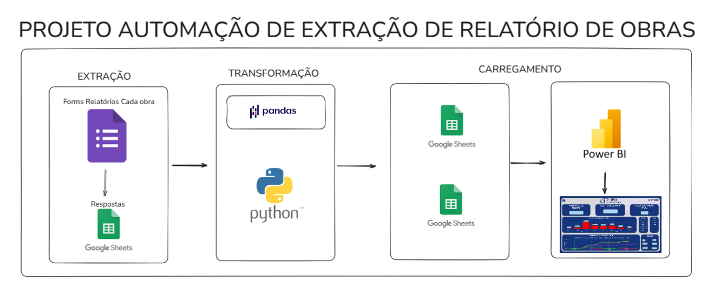

# Automação de Relatório de Obras
---

---
### Justificativa:
- Ao retirar os dados das respostas do google forms durante meu acompanhamento de obra, percebi **gargalos** na questão de perca de tempo manual para transformar todas as respostas que estavam em colunas, em linhas, fazer as regras de negócios necessárias para as planilhas. Isso para muitas respostas custava um bom tempo.

### Solução:
- Para isso desenvolvi um **ETL** que extrai dados do Google Sheets, realiza as transformações necessárias utilizando **pandas** e carrega novamente para outro Google Sheets principal em que irei realizar minha integração ao PowerBI

### Resultado:
- Com isso poupei cerca de mais de 1 hora por dia, aumentei a produtividade, apliquei engenharia de dados no meu dia a dia.
